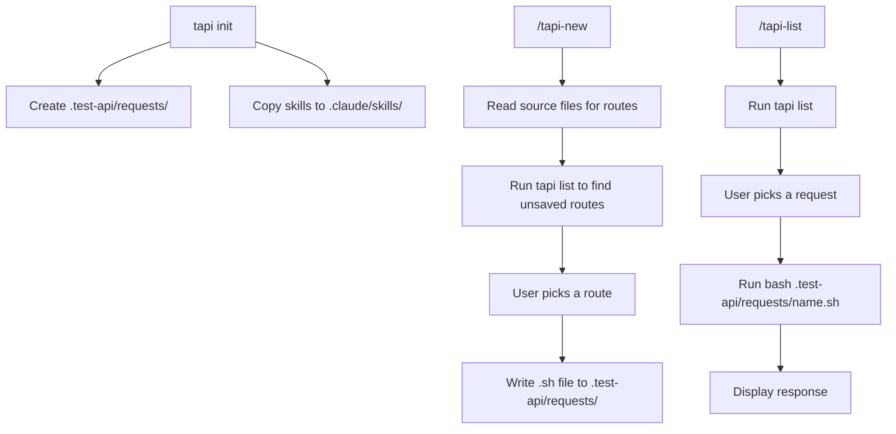

# tapi

A CLI and Claude Code skill for testing REST APIs. Requests are saved as bash scripts so they run standalone without `tapi` installed.

```bash
# install Go and jq
brew install go jq

# install tapi
go install github.com/angelinara/test-api/cmd/tapi

# set up tapi in your project (creates .test-api/requests/ and copies skills)
tapi init

# list saved requests
tapi list
```

## Usage

| Command | What it does |
|---------|-------------|
| `tapi init` | Set up `.test-api/requests/` and install Claude Code skills |
| `tapi list` | List saved requests with method, URL, and description |
| `/tapi-new` | Find routes in the codebase, create a new request file |
| `/tapi-list` | Pick a saved request and run it |

## Architecture


